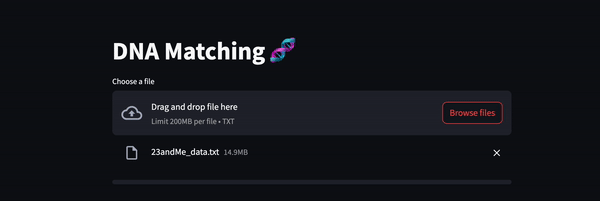
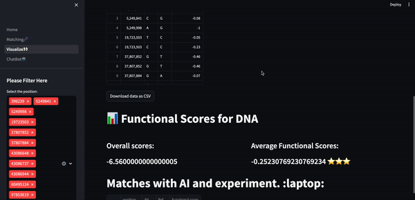

## Environment
pandas==2.1.3
streamlit==1.28.2

## Data file generate
### Following steps will create Sorted_Alpha.csv and Sorted_MaveDB.csv file to run this app.
After Download the file.
Run this in Terminal > "cat chunk* > Sorted_Alpha.csv.zip"
Run this in Terminal > "cat chunk* > Sorted_MaveDB.csv.zip"

Then unzip it. You will get Sorted_Alpha.csv, Sorted_MaveDB.csv file.

Run `database_setup.sh`to create the Streamlit databse files in current directory. 

# Step1
### Download Streamlit_app package

# Step2
### Make sure install streamlit in your environment.

# Step3
### Type "streamlit run Home.py" (The direction should be same as in Home.py)

# Step4
### Upload your 23andMe.tx file. (Makes sure your last column name should call genotype)

## After matching finished. You may download your each data .csv file.

