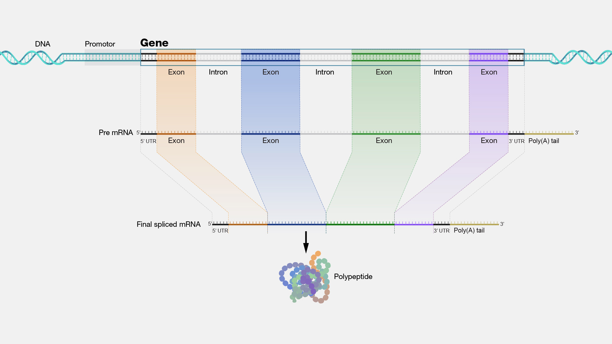
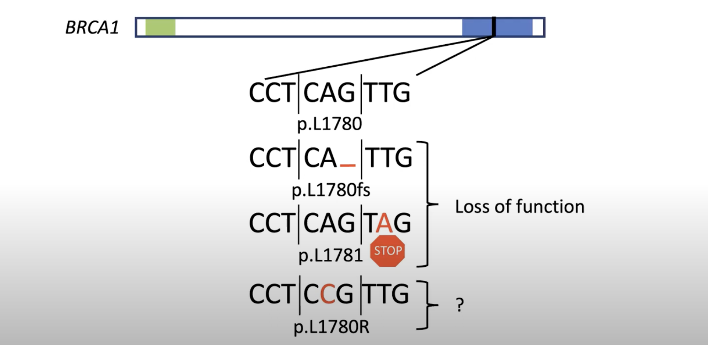
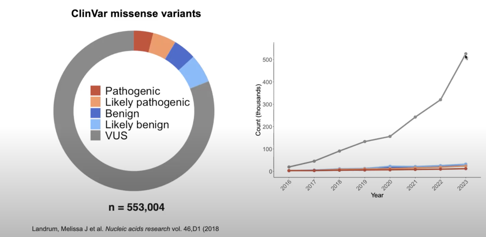
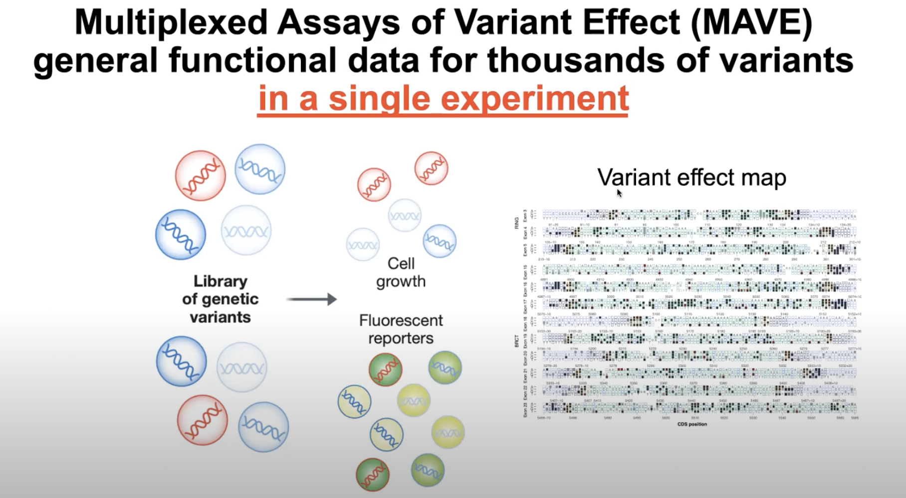
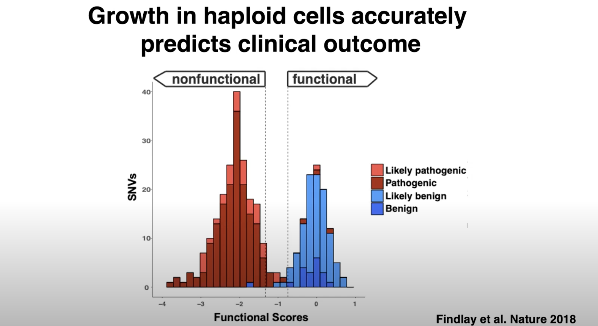

# UltraGene Intro

The gene is considered the basic unit of inheritance. Genes are passed from parents to offspring and contain the information needed to specify physical and biological traits. Most genes code for specific proteins, or segments of proteins, which have differing functions within the body. Humans have approximately 20,000 protein-coding genes.  

For more information, you can visit the [National Human Genome Research Institute](https://www.genome.gov/genetics-glossary/Gene).

## **A specific example**

BRCA1 and BRCA2 are the first two genes found to be associated with inherited forms of breast cancer and ovarian cancer. People with mutations in either BRCA1 or BRCA2 have a much higher risk for developing breast, ovarian or other types of cancer than those without mutations in the genes. Both BRCA1 and BRCA2 normally act as tumor suppressors, meaning they help to regulate cell division. Most people have two active copies of these genes. When one of the two copies becomes inactive due to an inherited mutation, a person’s cells are left with only one copy. If this remaining copy also becomes inactivated, then uncontrolled cell growth results, which leads to breast, ovarian or other types of cancer.

For more information, you can visit the [National Human Genome Research Institute](https://www.genome.gov/genetics-glossary/BRCA1-BRCA2).

We are good at understanding genetic mutations that completely destroy the protein and result in a clear non-functional gene and function. This is similar to removing the engine from a car, resulting in a loss of function. What is more difficult and where the value add of this project lies is in providing data for so-called missense mutations, where there is a simple amino acid change, similar to changing the color of a car from red to green, and trying to figure out if it can impact how it functions.

Why is this important? As shown below, greater than 50% of current genetic testing results are these missense genetic variants called Variants of Uncertain Significance. 

## Functional Genetic Studies to fill in missing gap

Multiplex Assays of Variant Effect (MAVE) take a target gene like BRCA1 and generate a map relating all possible mutations in the gene with function. So, when we see a rare mutation in a person, we can compare its impact on the gene in the cell culture and determine if the mutation is pathogenic or benign. Ultimately, this generates a Variant Effect Map that can inform GENETIC DISEASE RISK.

Below is a setup of the assay - 

Below are typical scores for all mutations, where we see a bimodal distribution for functional and non-functional scores. 

## Connecting the dots 

UltraGene takes as input a 23andMe SNP raw data and does a lookup in the MAVE functional score data and outputs the functional score / prediction for a given mutation the individual has. This allows the individuals to make better-informed medical decisions. 

**UltraGene repeats this process using AI-derived in-silico predictions, such as AlphaMissense, which are comparable in performance to MAVE functional data generated from growing actual cells in the lab.** 

